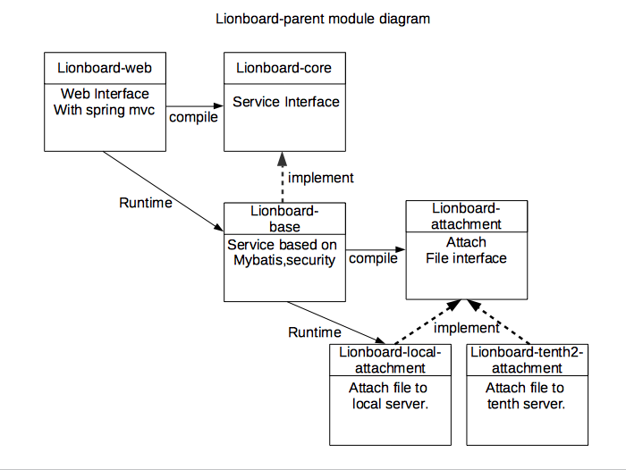

lionboard
=========

공부삼아 만들어보는 java-spring-mybatis 게시판

설치 & 빌드
-----------

```
$ git clone git@github.com:KD4/LionBoard.git
$ cd lionboard
$ mvn clean package -Dmaven.test.skip=true
```

모듈 다이어그램
-----------

